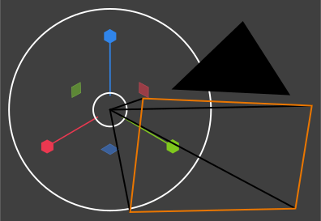

# OrthoScale219 (Blender Add-On)



<details>
<summary>Click to view full directory structure</summary>
<pre>
./
├── __init__.py
├── .gitignore
├── .pylintrc
├── blender_manifest.toml
├── CHANGELOG.md
├── LICENSE.md
├── pyproject.toml
├── README.md
├── requirements.txt
├── tests/
│   ├── conftest.py
│   └── test_ortho_scale_219.py
├── docs/
│   ├── api-docs.md
│   ├── installation-guide.md
│   ├── README.md
│   ├── troubleshooting.md
│   ├── usage.md
│   └── images/
│       ├── ortho-scale-219-logo.svg
│       └── sources/
│           ├── blender-camera.svg
│           ├── blender-scale-gizmo.svg
│           └── README.md
├── dev/
│   ├── README.md
│   └── stubs/
│       ├── bpy/
│       │   ├── __init__.pyi
│       │   ├── props.pyi
│       │   ├── utils.pyi
│       │   ├── ops/
│       │   │   └── __init__.pyi
│       │   └── types/
│       │       └── __init__.pyi
│       ├── mathutils/
│       │   └── __init__.pyi
│       └── pytest/
│           └── __init__.pyi
└── .github/
    ├── CODE_OF_CONDUCT.md
    ├── CODEOWNERS
    ├── CONTRIBUTING.md
    ├── dependabot.yml
    ├── funding.yml
    ├── GOVERNANCE.md
    ├── labeler.yml
    ├── mergify.yml
    ├── release-drafter.yml
    ├── renovate.json
    ├── SECURITY.md
    ├── SUPPORT.md
    ├── ISSUE_TEMPLATE/
    │   ├── bug-report.md
    │   ├── config.yml
    │   ├── custom.md
    │   ├── feature-request.md
    │   ├── misc-issue.md
    │   └── welcome-message.md
    ├── PULL_REQUEST_TEMPLATE/
    │   ├── bug-fix.md
    │   ├── code-change.md
    │   ├── config.yml
    │   ├── documentation.md
    │   └── security-fix.md
    └── workflows/
        ├── build.yml
        ├── compliance-check.yml
        ├── deploy.yml
        ├── e2e.yml
        ├── labeler.yml
        ├── lint.yml
        ├── matrix.yml
        ├── release-drafter.yml
        ├── release.yml
        ├── security-scan.yml
        ├── stale.yml
        └── test.yml
</pre>
</details>

## Table of Contents

- [Overview](#overview)
- [Features](#features)
- [Downloads](#downloads)
- [Usage](#usage)
- [Requirements](#requirements)
- [Documentation Portal (Detailed Guides)](docs/README.md)
- [Changelog](CHANGELOG.md)
- [License](LICENSE.md)
- [Commercial Licensing](#commercial-licensing)
- [Author](#author)
- [Acknowledgments](#acknowledgments)
- [Contributing](.github/CONTRIBUTING.md)
- [Security Policy](.github/SECURITY.md)

## Overview

OrthoScale219 is a Blender add-on designed to create uniform orthographic camera setups that render at an explicitly defined pixel-to-Blender-Unit ratio. It automatically bounds the camera view around target mesh objects, applying configurable margins for padding. This tool is useful for precise orthographic rendering tasks, such as technical illustrations, 2D asset generation, or exporting images at consistent scales.

This add-on provides a user-friendly panel in the Render properties tab, allowing users to manage multiple configurations, select cameras and objects, adjust scale and margin settings, and compile the camera with a single click. It supports undo/redo operations and provides detailed feedback via Blender's reporting system.

Key highlights:
- **Pixel-Perfect Scaling**: Set exact pixels per Blender Unit for high-precision renders.
- **Bounding Box Automation**: Automatically centers and scales the camera based on selected meshes.
- **Multi-Configuration Support**: Save and switch between different setups within the same scene.
- **Clip Plane Optimization**: Automatically adjusts clip start/end to bound perfectly around the selected objects.

This add-on is compatible with Blender 4.5.0 and later, and it persists configurations at the scene level for easy reuse.

## Features

- **Orthographic Camera Compilation**: Validates and sets the camera type to 'ORTHO', calculates resolution based on pixels per unit, adjusts orthographic scale, centers the view, and optimizes clip planes.
- **Object Bounding**: Computes bounding boxes in camera space using evaluated depsgraph for accuracy, handling multiple meshes and vertex transformations.
- **UI Panel Integration**: Located in `Properties > Render > OrthoScale219`; includes lists for configurations and objects, property fields for settings, and operators for adding/removing items.
- **Polling for Validity**: Custom poll functions ensure only mesh objects and cameras are selectable.
- **Reporting and Feedback**: Uses Blender's self.report for errors (e.g., no valid objects), warnings (e.g., objects behind camera), and info (e.g., setup completion details).
- **Undo/Redo Support**: All operators are registered with 'REGISTER' and 'UNDO' options.
- **Helper Functions**: Internal bounding box calculation that modifies camera position for centering.
- **Persistent Storage**: Settings are attached to the scene via a custom property group.

## Documentation Portal

Immerse in resources: [docs/README.md](docs/README.md)

## Downloads

To obtain the OrthoScale219 add-on files, use the official GitHub repository. This ensures you get the latest version, access to releases, and any future updates. Releases are recommended for most users, as they provide pre-packaged ZIP files for straightforward installation.

### Download Options

**A. From Releases (Recommended for Installation)**:
   - Go to the [OrthoScale219 GitHub Releases page](https://github.com/SA-Lowell/OrthoScale219/releases).
   - Select the latest release.
   - Download the ZIP file.
   - This ZIP contains all necessary files and is ready for Installation Method 1 below.

**B. Clone the Repository (For Developers or Advanced Users)**:
   - If you have Git installed, clone the repo for the full source:
     ```bash
     git clone https://github.com/SA-Lowell/OrthoScale219.git
     ```
   - Navigate into the cloned directory to access the files.
   - This is useful if you want to modify the code or view the full history.

**C. Direct File Downloads**:
   - From the [GitHub repository main page](https://github.com/SA-Lowell/OrthoScale219), browse to individual files.
   - Click the file to open its page.
   - Above the file's full text, click the `Download raw file` button.
   - Use this for Installation Method 2 if you prefer not to download the full ZIP.

**Notes**:
- Always download from the official repository to avoid modified or unsafe versions.
- Check the [CHANGELOG.md](CHANGELOG.md) in the repo for version details before downloading.
- If no releases are available yet, go to the repo's main page and click the `Code > Download ZIP` button for the latest development version and follow Installation Method 2.

## Installation

For detailed installation instructions, see [docs/installation-guide.md](docs/installation-guide.md).

## Usage

For full usage guide, examples, and configuration, see [docs/usage.md](docs/usage.md).

## Configuration Options and Examples

For examples, configuration options, and scripting, see [docs/api-docs.md](docs/api-docs.md).

## Requirements

- **Blender Version**: 4.5.0 or later (as specified in `blender_manifest.toml`). Some older versions might work but are not recommended.
- **Python**: Built-in Blender Python (no external installs needed).
- **Hardware**: Standard Blender requirements; higher pixels per unit may increase render time/memory.

## Troubleshooting

For troubleshooting, see [docs/troubleshooting.md](docs/troubleshooting.md).

## Changelog

See [CHANGELOG.md](CHANGELOG.md) for a detailed history of changes.

## License

This add-on is released under the [PolyForm Noncommercial License 1.0.0](https://polyformproject.org/licenses/noncommercial/1.0.0/).

- **Non-Commercial Use**: You are free to use, modify, and share OrthoScale219 for personal, educational, research, hobby, or other non-commercial purposes without charge (provided you include the required notices as per the license).
- **Commercial Use**: Any commercial or for-profit use requires purchasing a separate license from the author. Contact S.A. Lowell via [https://salowell.com/dev/Blender/OrthoScale219/] or email for details and pricing.
- **Attribution**: As per the license, include the required copyright notice and link in any distributions (see the LICENSE file for specifics).

Full license terms in [LICENSE.md](./LICENSE.md). Copyright © 2025 S.A. Lowell. All rights reserved.

## Commercial Licensing

For commercial, for-profit, or monetary use (e.g., in business workflows, client projects, or revenue-generating activities), a paid license is required. This separate agreement grants:
- Unlimited commercial use and modifications.
- No non-commercial restrictions.
- Optional add-ons like priority support, custom features, or indemnity.

Note: The commercial license prohibits resale, sublicensing, or redistribution for sale of the add-on (original or modified) without prior written consent from the author.

Pricing: Individual: $5 (perpetual, single user). Team: $25 (2–5 seats). Enterprise: $40 (unlimited seats, basic support; volume discounts available). To inquire or purchase, contact me at [https://salowell.com/dev/Blender/OrthoScale219/](https://salowell.com/dev/Blender/OrthoScale219/). Upon payment, you'll receive the full license agreement via email or download. If you do not receive an email confirmation after payment, please contact me at [https://salowell.com/dev/Blender/OrthoScale219/](https://salowell.com/dev/Blender/OrthoScale219/) so I can manually send it to you.

## Community Guidelines

Follow our [Code of Conduct](.github/CODE_OF_CONDUCT.md) for respectful interactions in issues or discussions.

For contributions (not currently accepted), see [.github/CONTRIBUTING.md](.github/CONTRIBUTING.md).

Report vulnerabilities via [.github/SECURITY.md](.github/SECURITY.md).

Project governance details in [.github/GOVERNANCE.md](.github/GOVERNANCE.md).

Support questions? Check [.github/SUPPORT.md](.github/SUPPORT.md).

## Author

- **S.A. Lowell**: Developer and maintainer.
- Contact: [https://salowell.com/dev/Blender/OrthoScale219/](https://salowell.com/dev/Blender/OrthoScale219/).

## Acknowledgments

- Built using Blender's Python API (bpy, mathutils).
- Inspired by needs for precise orthographic rendering in technical workflows.

For more, refer to source docstrings or Blender's add-on docs.